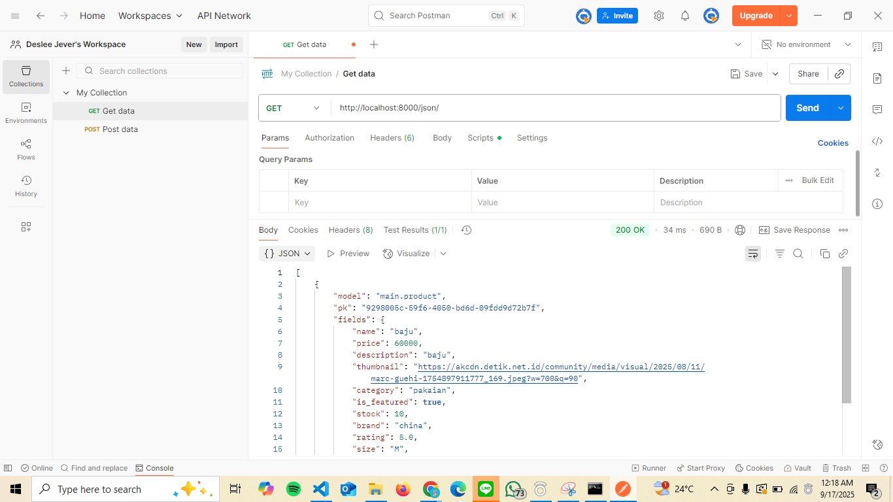
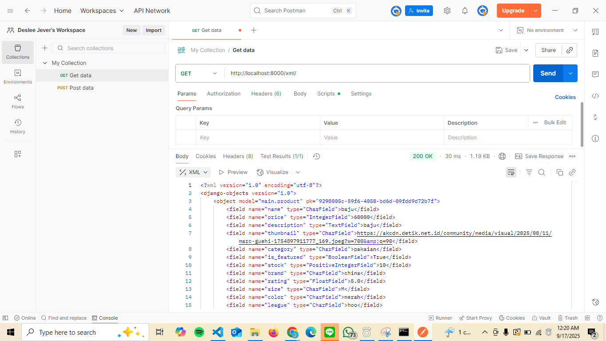
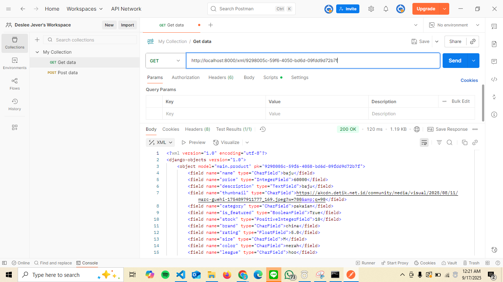
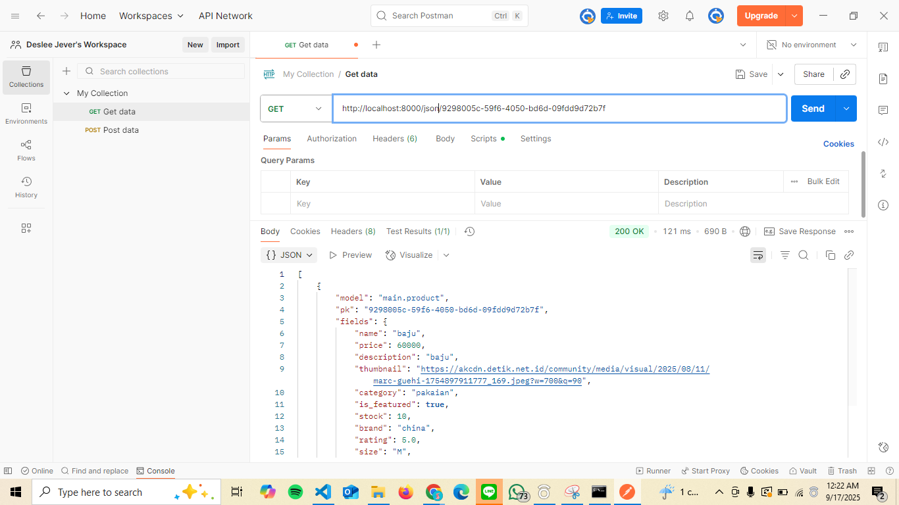

1. Jelaskan bagaimana cara kamu mengimplementasikan checklist di atas secara step-by-step (bukan hanya sekadar mengikuti tutorial).
Jawaban :
    Langkah pertama yang aku lakukan saat mengerjakan tugas ini adalah mengikuti seluruh checklist yang sudah diberikan. Setelah itu, aku memikirkan nama yang relevan untuk aplikasi “Football Shop”, lalu memilih nama KickMart.
    
    step yang aku lakukan pertama kali adalah membuat repository baru di GitHub, lalu melakukan clone ke lokal. Aku mengikuti instruksi Tutorial 0 dan Tutorial 1 untuk instalasi Django dan inisiasi proyek Django dan MVT. Di CMD pada direktori kickmart, aku membuat virtual environment dengan:
        python -m venv env
        env\Scripts\activate
    Virtual environment ini berfungsi mengisolasi package dan dependencies agar tidak bentrok dengan versi lain. Aku menyiapkan dependencies dan membuat proyek Django. Di direktori yang sama, aku membuat berkas .txt berisi daftar dependencies, lalu menginstalnya. Setelah itu, aku menjalankan perintah untuk membuat project dan app. Aku melakukan konfigurasi environment variables dan proyek. Environment variables disimpan di luar kode untuk menyimpan informasi konfigurasi seperti kredensial database, API keys, atau pengaturan environment. Aku mengatur settings.py supaya Django “mengerti” struktur proyeknya, lalu menambahkan domain PWS ke ALLOWED_HOSTS (format: <username-sso>-<nama-proyek>.pbp.cs.ui.ac.id). Aku melakukan migrasi database, lalu menjalankan server Django dengan:
        python manage.py runserver
    Jika berhasil, lanjut ke langkah berikutnya.

    Aku melakukan push ke GitHub untuk pekerjaan Instalasi Django dan Inisiasi Proyek Django yang sudah dilakukan. Setelah halaman default Django muncul, aku lanjut ke materi MVT: menjalankan python manage.py startapp main, mendaftarkan 'main' ke INSTALLED_APPS, membuat models sesuai atribut tugas, membuat templates/main.html sederhana (judul KickMart + Name + Class untuk identitas), lalu membuat view show_main yang mengirim context (nama/kelas) ke template. Selanjutnya atur routing: di config/urls.py include main.urls, dan di main/urls.py map "" ke show_main sehingga akses root langsung merender halaman utama. Mengikuti arahan tutorial, aku mendefinisikan model dasar di app (contoh tutorial pakai News, punyaku Product), lalu menjalankan makemigrations dan migrate supaya skema database terbentuk. Terakhir, commit dan push lagi ke GitHub. Kemudian aku Deploy ke PWS: di halaman PWS aku membuat project, menjalankan Project Command yang diberikan PWS (pakai kredensial PWS, bukan SSO). Setelah status berubah dari Building menjadi Running, aku klik View Project saat sudah running.

2. Buatlah bagan yang berisi request client ke web aplikasi berbasis Django beserta responnya dan jelaskan pada bagan tersebut kaitan antara urls.py, views.py, models.py, dan berkas html.
Jawaban :
    

3. Jelaskan peran settings.py dalam proyek Django!
Jawaban : 
    menurut aku settings.py itu kayak buku aturan buat proyek Django karena di situ kita ngatur semuanya kaya mau mode belajar atau produksi (DEBUG), kunci rahasia (SECRET_KEY), situs mana yang boleh akses (ALLOWED_HOSTS), aplikasi apa aja yang dipakai (INSTALLED_APPS), jalur halaman & template, sambungan ke database (DATABASES), tempat simpan file statis & media, bahasa dan zona waktu, sampai hal keamanan kayak CSRF. Intinya, supaya si Django tahu “aturan main” proyek kita dari A sampai Z deh.

4. Bagaimana cara kerja migrasi database di Django?
Jawaban : 
    hal pertama yang dilakukan sebelum migrasi data adalah mengubah model (mengedit models.py yang sesuai dengan attribute yang kita mau) kemudian kita lakukan
        python manage.py makemigrations 
    gunanya adalah untuk mencatat setiap perubahan yang ada dan menerapkan ke database yang beneran nya dengan cara  
        python manage.py migrate
    Saat menjalankan makemigrations Django nge-scan models.py buat lihat struktur terbaru terus dibandingin dengan “versi sebelumnya” yang tersimpan di file migrasi. sedangkan kalo menjalankan migrate Django baca semua rencana (file migrasi) dan cek yang belum dijalankan lewat tabel internal. Diurutkan sesuai dependency (biar nggak salah urut antar-app). abis tu diterjemahin jadi perintah SQL sesuai database terus dieksekusi ke database dan dicatat ke django_migrations bahwa migrasinya sudah sukses, jadi nggak dijalankan dua kali.

5. Menurut Anda, dari semua framework yang ada, mengapa framework Django dijadikan permulaan pembelajaran pengembangan perangkat lunak?
Jawaban : 
    menurut aku Django cocok buat mulai karena ia mengajarkan banyak konsep inti rekayasa perangkat lunak secara lengkap buat bikin web. Jadinya kita gak perlu rakit banyak hal sendiri karena udah ada login, database, halaman admin, template, sampai keamanan dasar. Strukturnya juga rapi (model–view–template) jadi kita juga bisa cepat paham sama alurnya. Belajarnya enak karena pakai Python dan cepat lihat hasil (admin langsung jadi). 

6. Apakah ada feedback untuk asisten dosen tutorial 1 yang telah kamu kerjakan sebelumnya?
Jawaban : 
    dari setiap tutorial yang ada sudah cukup baik dan juga sangat detail setiap perintahnya dan apa aja yang udah dikerjain terus dari tutorial itu juga gak cuman sekedar tamplate aja yang kita dapet tapi kita juga jadinya bisa paham setiap penjelasan nya karena beneran di jelasin juga setiap penggunaan nya untuk apa dan buat apa jadinya sejauh ini sudah baik terimakasih ya kak.

Pertanyaan Tugas 3 :

1. Jelaskan mengapa kita memerlukan data delivery dalam pengimplementasian sebuah platform?
Jawaban :
    karena kalau kita bikin aplikasi atau platform, kan pasti ada data yang harus jalan-jalan dari server ke user, atau dari user ke server. Nah, proses nganterin datanya ini yang disebut data delivery. Karena kalo tanpa itu, aplikasi kita cuma diem aja, gak bisa tukeran info. Jadi data delivery itu semacam kalo di perumpamain kaya kurir, biar data bisa sampe dengan aman dan sesuai kebutuhan.

2. Menurutmu, mana yang lebih baik antara XML dan JSON? Mengapa JSON lebih populer dibandingkan XML?
Jawaban :
    menurut ku XML dan JSON sama-sama bisa digunakan untuk pertukaran data, namun JSON lebih populer karena strukturnya lebih sederhana, ringkas, dan mudah dibaca buat kita manusia maupun mesin. JSON juga biasanya langsung terintegrasi dengan bahasa pemrograman modern, sehingga proses parsing lebih cepat dan efisien dibandingkan XML yang cenderung lebih berat dan verbose.

3. Jelaskan fungsi dari method is_valid() pada form Django dan mengapa kita membutuhkan method tersebut?
Jawaban :
    Method is_valid() pada form Django berfungsi untuk melakukan validasi data yang dimasukkan pengguna dengan method tersebut, kita bisa memastikan data yang masuk sudah sesuai dengan aturan yang ditentukan misalnya format email atau panjang teks. Jika data tidak valid, Django akan memberikan pesan error sehingga data yang tersimpan ke database tetap bersih dan konsisten.
    

4. Mengapa kita membutuhkan csrf_token saat membuat form di Django? Apa yang dapat terjadi jika kita tidak menambahkan csrf_token pada form Django? Bagaimana hal tersebut dapat dimanfaatkan oleh penyerang?
Jawaban :
    karena csrf_token digunakan untuk melindungi aplikasi dari serangan CSRF (Cross Site Request Forgery). Nah token ini memastikan bahwa permintaan yang dikirim melalui form memang berasal dari pengguna yang sah dan bukan dari pihak luar. Jika kita tidak menggunakan csrf_token, penyerang bisa membuat pengguna tanpa sadar mengirimkan request berbahaya, seperti melakukan transaksi atau mengubah data penting, sehingga keamanan aplikasi menjadi sangat rentan.
    
5. Jelaskan bagaimana cara kamu mengimplementasikan checklist di atas secara step-by-step (bukan hanya sekadar mengikuti tutorial).
Jawaban :
    pertama aku menyiapkan skeleton dengan membuat base.html di folder templates lalu menghubungkannya lewat pengaturan templates di settings.py agar semua halaman bisa mewarisi kerangka yang sama. Setelah itu aku membuat model dan form (ProductForm) menggunakan ModelForm untuk mempermudah input data. Di views.py, aku juga menambahkan fungsi show_main untuk menampilkan semua berita, create_product untuk menambahkan berita baru dengan validasi is_valid(), serta show_product untuk menampilkan detail berita. Kemudian aku mengatur routing di urls.py agar setiap fungsi dapat diakses, membuat template main.html, create_news.html, dan news_detail.html untuk menampilkan data dan form, serta menambahkan csrf_token sebagai perlindungan keamanan. Setelah itu aku menambahkan endpoint show_xml dan show_json agar data bisa diakses dalam format XML dan JSON, lalu menambahkan fungsi by-id untuk mengakses data tertentu berdasarkan primary key. Semua endpoint ini aku uji menggunakan browser dan Postman untuk memastikan data tampil sesuai formatnya. Terakhir, aku melakukan commit dan push ke GitHub dan PWS agar aplikasi bisa dideploy dengan baik.

6. Apakah ada feedback untuk asdos di tutorial 2 yang sudah kalian kerjakan?
Jawaban : 
    ka jujur pas di tutorial 2 aku agak sedikit kebingungan mungkin karena aku kurang teliti dalam memahami kata katanya kali ya ka tapii overall sudah okay kok makasih ya ka 

Penggunaan Postman Sebagai Data Viewer :
1. 
2. 
3. 
4. 

Pertanyaan Tugas 4 :

1. Apa itu Django AuthenticationForm Jelaskan juga kelebihan dan kekurangannya.
Jawaban : 
    AuthenticationForm adalah form bawaan dari django.contrib.auth.form dia biasanya dipakai untuk proses login untuk memvalidasi username dan juga password. Secara default AuthenticationForm memanggil authenticate() dan menyimpan user yang valid di form.get_user(). Kelebihannya adalah AuthenticationForm ini sudah jadi dari awal, jadi kita nggak perlu bikin form login dari nol jadinya kita bisa langsung pakai untuk membuat fitur login standar. AuthenticationForm ini juga udah nyambung dengan sistem login bawaan Django, jadi kalau kita pakai username dan password, otomatis bisa dicek apakah benar atau salah. Kalau ada kesalahan, misalnya password salah atau akun tidak sesuai, dia bisa kasih pesan error dan bilang kalo itu tu ga sesuai. Sedangkan kekurangannya, AuthenticationForm  ini cuma mendukung login pakai username secara default. Jadi kalau kita mau login pakai email, nomor HP, atau yang lain nya, kita harus bisa ngatur sendiri. 

2. Apa perbedaan antara autentikasi dan otorisasi? Bagaiamana Jawaban : 
    Django mengimplementasikan kedua konsep tersebut?
    Autentikasi adalah proses yang digunakan untuk mengonfirmasi identitas pengguna, perangkat, atau sistem sebelum memberikan akses ke sumber daya. Sedangkan otorisasi didefinisikan sebagai proses menentukan apa yang boleh dilakukan oleh pengguna atau sistem yang diautentikasi. Setau aku kalo cara django implementasiin nya yang autentikasi dia pake authenticate() untuk cek username/password terus abis tu login() untuk menyimpan user ke session abis tu Middleware AuthenticationMiddleware nah dia bakalan bikin request.user abis tu kalo belum login dia bakalan request.user jadi AnonymousUser. Sedangkan kalo otorisasi dari sumber yang aku dapatkan dia bakalan ke user.has_perm('app.action_model') buat cek apakah user punya izin tertentu kemudian @login_required dipakai sebagai decorator di view jadi hanya user yang sudah login bisa akses view itu kalau user belum login bakalan otomatis diarahkan ke halaman login lalu ada @permission_required / PermissionRequiredMixin buat cek izin khusus sebelum user bisa akses view. Group (role)group dipakai buat ngumpulin user dengan izin yang sama. Misalnya ada role admin, staff, member biasa di admin panel Django,bisa bikin Group, lalu kasih izin tertentu ke Group itu sedangkan kalo user yang dimasukin ke Group otomatis dapat semua izin dari Group.

3. Apa saja kelebihan dan kekurangan session dan cookies dalam konteks menyimpan state di aplikasi web?
Jawaban :
    Cookies terdai penyimpanan di browser, tiap request dikirim ke server ukuran nya juga terbatas 4KB per cookie. Kelebihan Cookies pertama simpel karena langsung di client (tidak perlu penyimpanan server) kedua Cocok untuk data ringan dan tidak rahasia ketiga Kalau kamu set cookie dengan waktu kadaluarsa misalnya 1 minggu, maka meski browser ditutup, saat dibuka lagi datanya masih ada. Kekurangan Cookies pertama karena cookie ada di browser, user bisa mengubah nilainya. kedua rentan dicuri lewat XSS (jika HttpOnly=False) ketiga ukuran terbatas tidak cocok simpan data besar terakhir privasi / compliance (GDPR) perlu handling

    Sessions server menyimpan data session (DB/cache), browser hanya menyimpan session id cookie kelebihan nya yang pertama aman untuk data sensitif (tidak disimpan di browser), kedua bisa invalidate/revoke session dari server (logout all sessions), ketiga menyimpan struktur data kompleks. kekurngan nya pertama memerlukan penyimpanan di server, kedua Overhead pada I/O jika tidak dioptimasi (DB), ketiga masih bergantung pada cookie session id.

4. Apakah penggunaan cookies aman secara default dalam pengembangan web, atau apakah ada risiko potensial yang harus diwaspadai? Bagaimana Django menangani hal tersebut?
Jawaban : 
    Cookie itu nggak otomatis aman karena ada beberapa risiko. Misalnya, kalau ada script jahat (XSS), cookie bisa dibaca kalau tidak dilindungi. Kalau ada serangan CSRF, penyerang bisa pura-pura kirim request seolah-olah dari kita. Ada juga bahaya session fixation, yaitu penyerang maksa kita pakai session ID yang dia tentuin. Kalau cookie dikirim lewat HTTP biasa (tanpa HTTPS), orang di jaringan bisa nyolong datanya.
    
    Nah, Django sudah nyiapin cara buat ngatasi itu. Ada CSRF token biar request palsu nggak bisa lolos. Ada juga session rotation yang otomatis ganti session ID setelah login. Selain itu, kita bisa set cookie biar lebih aman, misalnya hanya dikirim lewat HTTPS (Secure), nggak bisa dibaca JavaScript (HttpOnly), dan atur cara dipakai antar situs (SameSite). Django juga punya signed cookies biar nggak bisa dimodifikasi sembarangan, serta middleware keamanan untuk header tambahan. Ditambah lagi, password di Django selalu disimpan dalam bentuk terenkripsi (hash), bukan asli.

5. Jelaskan bagaimana cara kamu mengimplementasikan checklist di atas secara step-by-step (bukan hanya sekadar mengikuti tutorial).
Jawaban : 
    Untuk tugas ke 4 kali ini hal pertama yang aku lakukan adalah membaca setiap checklist todo yang ada kemudian karena semua file atau format nya udah ada dan sesuai sama bentuk terakhir tugas 3 kemarin aku lanjutin aja di tahap tugas 4 ini pertama kali aku lakukan adalam membuat fungsi dan juga form registrasi kemudian aku mengerjakan dari views.py dan menambahkan beberapa import dan juga beberapa fungsi kemudian aku juga membuat html baru yaitu register.html setelah itu aku juga menyambungkan ke urls.py dengan menambahkan impor fungsi yang sudah di buat sebelum nya dan menambahkan path url. Lalu membuat fungsi login dengan menambahkan kembali import serta fungsi baru dan juga membuat html baru berupa login.html setelah itu aku juga menyambungkan ke urls.py dengan menambahkan impor fungsi yang sudah di buat sebelum nya dan menambahkan path url. kemudian membuat fungsi logout degan melkukan hal yang sam aseperti sebelumnya mengimport dan menambahkan fungsi serta menambahkan potongan kode di bagian main.html setelah itu menghubungkan kembali dengan urls.py. kemudian aku melakukan Merestriksi Akses Halaman Main dan Product Detail, setelah itu Menggunakan Data Dari Cookies dan yang terakhir Menghubungkan Model Product dengan User

Tugas 5 :
1. Jika terdapat beberapa CSS selector untuk suatu elemen HTML, jelaskan urutan prioritas pengambilan CSS selector tersebut!
Jawaban :
    elemen HTML memiliki beberapa CSS selector yang berlaku, dimana browser akan menentukan style mana yang digunakan berdasarkan tingkat prioritas atau specificity. Urutan prioritasnya ini dimulai dari inline style yang ditulis langsung di elemen HTML, terus diikuti deh sama selector dengan ID, kemudian class, attribute, dan pseudo-class, dan yang paling rendah adalah selector berbasis tag atau elemen. Jika terdapat dua aturan dengan tingkat prioritas yang sama, maka aturan yang muncul paling terakhir dalam file CSS akan digunakan.

2. Mengapa responsive design menjadi konsep yang penting dalam pengembangan aplikasi web? Berikan contoh aplikasi yang sudah dan belum menerapkan responsive design, serta jelaskan mengapa!
Jawaan : 
    Responsive design menjadi konsep yang sangat penting dalam pengembangan aplikasi web karena pengguna mengakses internet melalui berbagai jenis perangkat, mulai dari smartphone, tablet, hingga komputer desktop. Dengan desain yang responsif, tampilan web nya dapat menyesuaikan ukuran layar sehingga pengguna tetap nyaman tanpa perlu melakukan zoom atau geser layar. Sebagai contoh, aplikasi web seperti Instagram sudah menerapkan responsive design sehingga tampilannya tetap rapi baik di layar ponsel maupun komputer. Sebaliknya, banyak website lama seperti situs sekolah atau instansi pemerintah masih menggunakan layout tetap, sehingga ketika dibuka melalui ponsel tampilannya tidak nyaman karena pengguna harus memperbesar layar secara manual.

3. Jelaskan perbedaan antara margin, border, dan padding, serta cara untuk mengimplementasikan ketiga hal tersebut!
Jawaban : 
    Dalam CSS terdapat konsep box model yang terdiri dari margin, border, dan padding. Nah margin ini adalah jarak luar antara sebuah elemen dengan elemen lain di sekitarnya. Border adalah garis tepi yang mengelilingi elemen dan membatasi area konten. Sedangkan padding adalah jarak dalam, yaitu ruang antara konten elemen dan garis border. Sebagai ilustrasi, konten berada di bagian terdalam, lalu dilapisi padding, diikuti border, dan terakhir margin sebagai ruang luar.

4. Jelaskan konsep flex box dan grid layout beserta kegunaannya!
Jawaban :
    Flexbox dirancang untuk mengatur tata letak satu dimensi, baik secara horizontal maupun vertikal, sehingga cocok digunakan ketika ingin mengatur susunan elemen agar sejajar, rata tengah, atau memiliki jarak antar elemen yang proporsional. Sedangkan grid layout memungkinkan pengaturan dua dimensi sekaligus, yaitu baris dan kolom, sehingga lebih cocok untuk membuat layout yang kompleks seperti dashboard atau halaman dengan banyak bagian. Secara sederhana, flexbox digunakan ketika fokus hanya pada satu arah, sedangkan grid digunakan ketika membutuhkan kontrol penuh pada baris dan kolom sekaligus.

5. Jelaskan bagaimana cara kamu mengimplementasikan checklist di atas secara step-by-step (bukan hanya sekadar mengikuti tutorial)!
Jawaban :
    Pada tugas kali ini aku mengerjakan sesuai dengan checklist yang sudah di berkan di tugas 5 kemudian aku mengikuti step by step seperti tutorial 4 hal pertama yang aku lakukan adalah menambhakan tailwind ke aplikasi setelah itu aku menambahkan sebuat fitur edit product dan juga menghapus product serta membuat berkas html baru untuk edit product nya.setelah itu aku menambahkan sebuah bar navigation di aplikasi website nya dan di bagian navbar ini aku menambahkan beberapa kode agar sesuai sama navbar yang aku pengen setelah itu aku melakukan konfigurasi static file di aplikasi web nya setelah itu aku membuat styling aplikasi nya dengan menggunakan tailwnd yang sudah aku tambahkan di awal dan external css setelah itu aku menghubungkan lobal css nya dengan script tailwind ke base html habis tu aku custom styling nya ke global.css sesuai dengan warna yang aku mau biru pastel dan putih dan aku melakukan styling navbar dan lain lain nya menyesuaikan dengan desain warna yang aku pengen deh.

Jawaban Tugas 6 :
